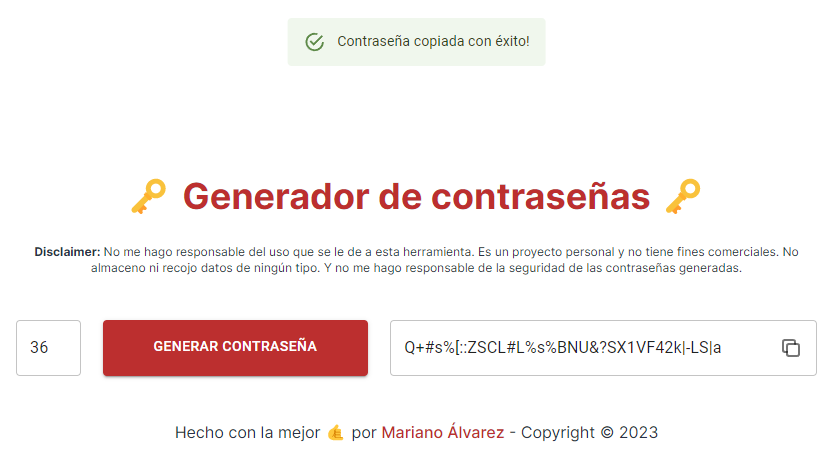

# Generador de passwords

Es un proyecto personal que hice para generar passwords de forma aleatoria.

## Pantallazo

## Colaboración

Si queres colaborar con el proyecto, podes hacerlo de las siguientes maneras:

-   Haciendo un fork del proyecto y enviando un pull request.
-   Creando un issue en el repositorio.
-   Contactandome por [Twitter](https://twitter.com/dev_creativoma).

## Licencia

MIT License - Copyright (c) 2023 Mariano Álvarez
